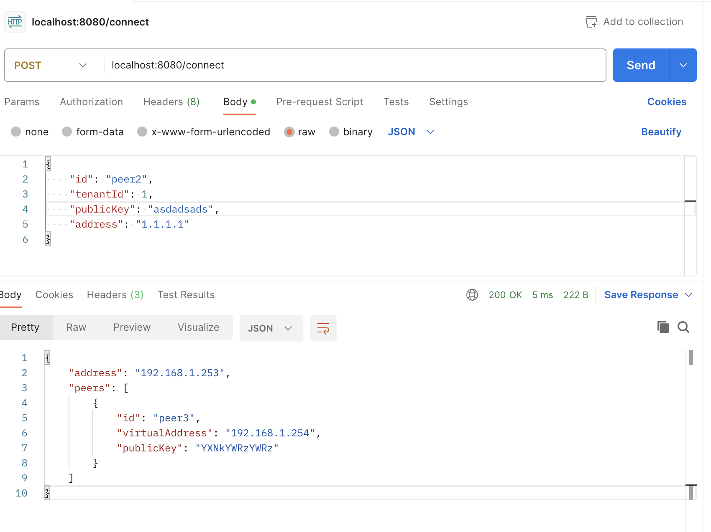
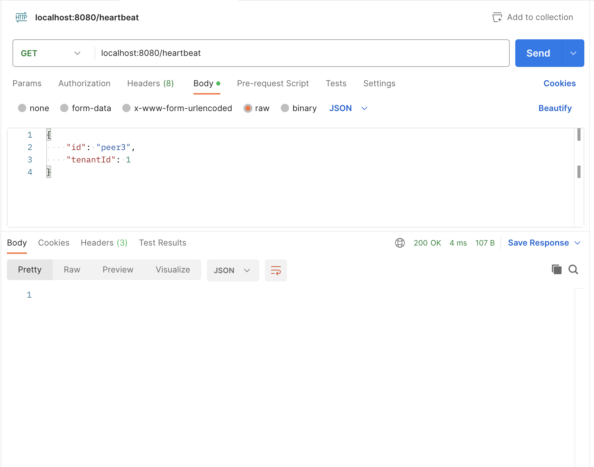
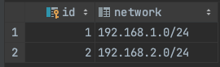
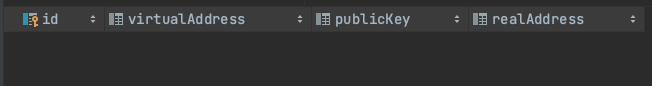

# vpn-orc
Small vpn orchestration service
<pre>
Please make sure to read the exercise notes.
</pre>

## Contents
1. [Diagram](#diagram)
2. [Build](#build)
3. [Request Examples](#request)
4. [Exercise Notes](#notes)

## Diagram

## Build
<pre>
1. Clone the repo
# git clone git@github.com:shneby/vpn-orc.git
# cd vpn-orc

2. Build the docker image
# docker build . -t vpn-orc

3. Run the application
# docker run -p 8080:8080 vpn-orc
</pre>

The application is now available on localhost:8080

## Request Examples
#### connect

#### heartbeat

## Notes
When reviewing the code please take into account go isn't my main language and I had to learn as I go (no pun intended)
1. The application is written with the assumption that oboarding a tenant is done via
an external process. The expectation being that the database already has tables that look like:

    
    

2. The database is set locally - in real world environment we would naturally use an external database which is scalable.
3. There is currently coupling between the orchestration & notification components,
given more time I would have suggested a design that incorporates an event bus between them.
4. The addressPool implementation currently pre-allocates all addresses ahead of time and saves them in a stack.
this will be a problem in real world system that may want to allocate class A networks.
In a production system a more sparse implementation should be used.
5. The notification service has a code segment which is commented out,
This is to prevent every notification request from timing out while evaluating the exercise.
In a real world scenario this would obviously not be commented.
6. There are no tests with code, this was done due to time constraints, obviously production code will require comprehensive testing.

